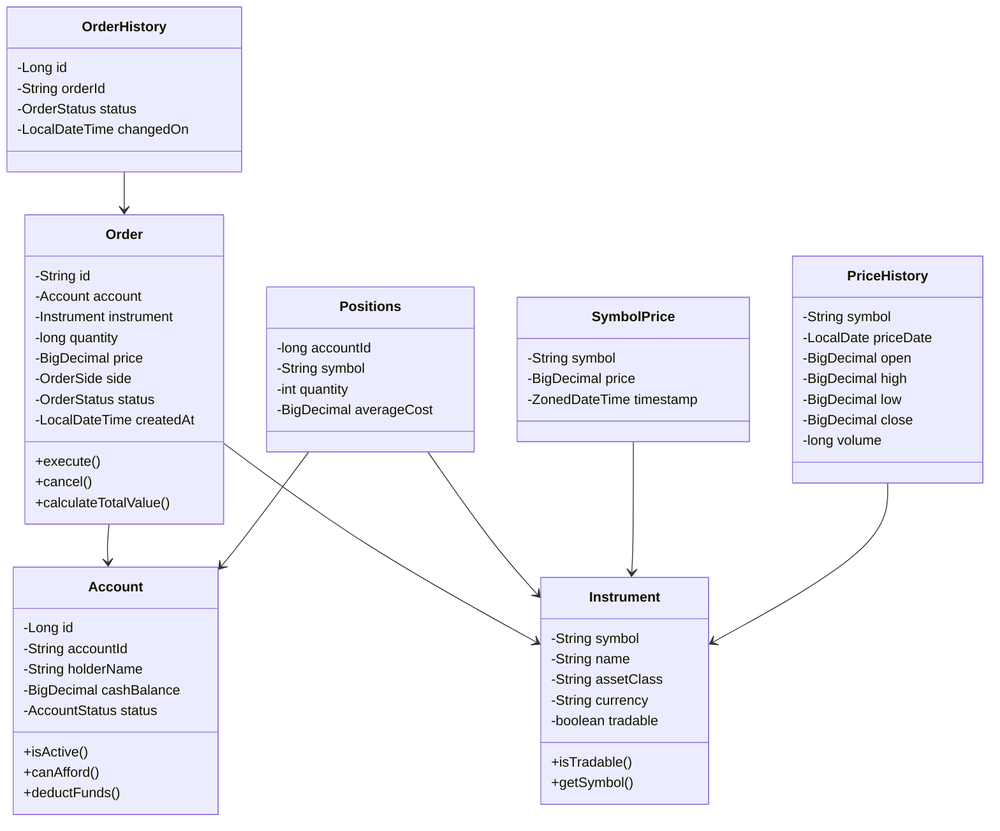

# Class Diagram - Order Management System

## Class Relationships

- **Order** → places trades against an **Account** and **Instrument**
- **OrderHistory** → tracks all status changes for an **Order**
- **Positions** → holds an **Account's** holdings in an **Instrument**
- **SymbolPrice** → current market price of an **Instrument**
- **PriceHistory** → historical OHLCV data for an **Instrument**
