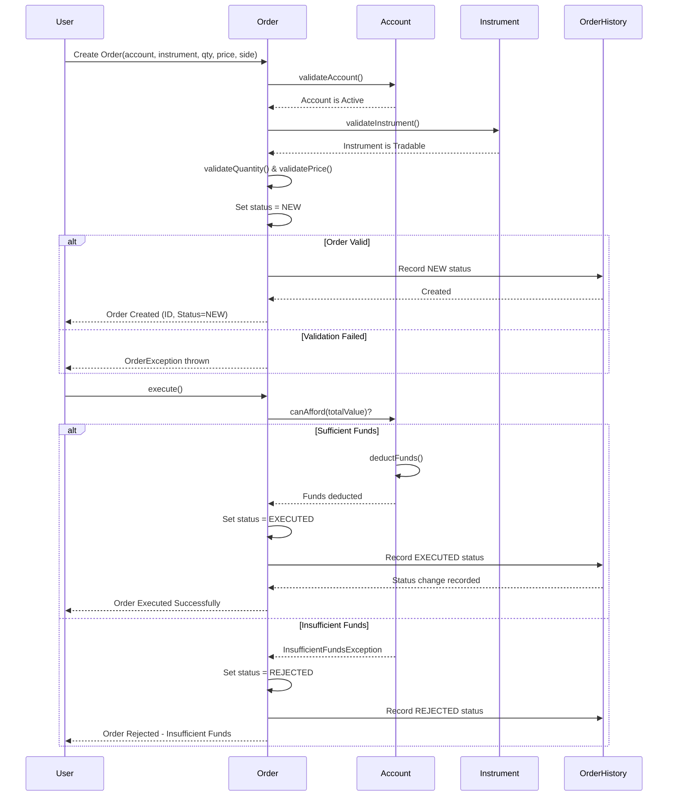

# Order Sequence Diagram

## Order Lifecycle Flow

1. **Order Creation**: User submits order with account, instrument, quantity, and price
2. **Validation**: Order validates account (active), instrument (tradable), and price/quantity
3. **Status Set to NEW**: Order is created with NEW status and audit record
4. **Order Execution**: User requests order execution
5. **Fund Check**: System checks if account has sufficient funds
6. **Execution or Rejection**: 
   - Success: Status changed to EXECUTED, funds deducted, audit record created
   - Failure: Status set to REJECTED, no funds deducted, audit record created
